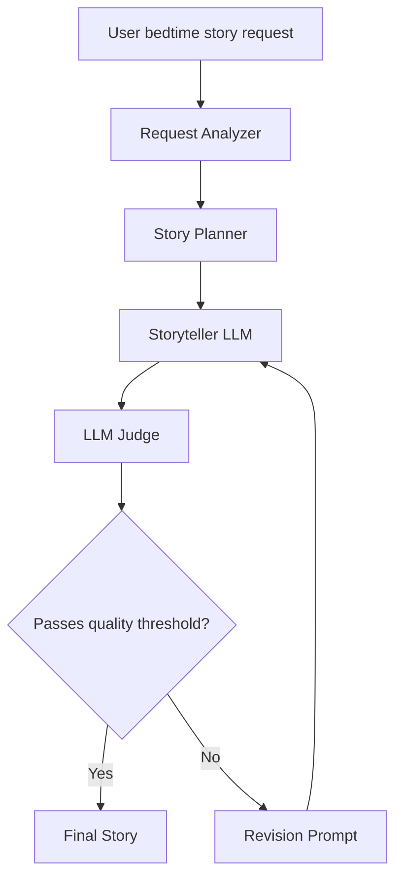

# System Design

## Design Summary

The system separates story generation into planning, storytelling, judging, and revision.  
The request analyzer extracts the target age, characters, tone, theme, and safety constraints.  
The storyteller uses this plan to generate an age-appropriate bedtime story.  
The judge evaluates the story for age appropriateness, safety, bedtime tone, story arc, creativity, and alignment with the user request.  
If the judge score is below the threshold, the story is revised using the judge's feedback.