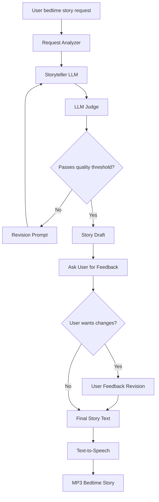

# Hippocratic AI Coding Assignment
Welcome to the [Hippocratic AI](https://www.hippocraticai.com) coding assignment

## Instructions
The attached code is a simple python script skeleton. Your goal is to take any simple bedtime story request and use prompting to tell a story appropriate for ages 5 to 10.
- Incorporate a LLM judge to improve the quality of the story
- Provide a block diagram of the system you create that illustrates the flow of the prompts and the interaction between judge, storyteller, user, and any other components you add
- Do not change the openAI model that is being used. 
- Please use your own openAI key, but do not include it in your final submission.
- Otherwise, you may change any code you like or add any files

---

## Rules
- This assignment is open-ended
- You may use any resources you like with the following restrictions
   - They must be resources that would be available to you if you worked here (so no other humans, no closed AIs, no unlicensed code, etc.)
   - Allowed resources include but not limited to Stack overflow, random blogs, chatGPT et al
   - You have to be able to explain how the code works, even if chatGPT wrote it
- DO NOT PUSH THE API KEY TO GITHUB. OpenAI will automatically delete it

---

## What does "tell a story" mean?
It should be appropriate for ages 5-10. Other than that it's up to you. Here are some ideas to help get the brain-juices flowing!
- Use story arcs to tell better stories
- Allow the user to provide feedback or request changes
- Categorize the request and use a tailored generation strategy for each category

---

## How will I be evaluated
Good question. We want to know the following:
- The efficacy of the system you design to create a good story
- Are you comfortable using and writing a python script
- What kinds of prompting strategies and agent design strategies do you use
- Are the stories your tool creates good?
- Can you understand and deconstruct a problem
- Can you operate in an open-ended environment
- Can you surprise us

---

## Other FAQs
- How long should I spend on this? 
No more than 2-3 hours
- Can I change what the input is? 
Sure
- How long should the story be?
You decide


# My Solution

## Bedtime Storytelling Assistant

This project implements a simple AI based bedtime storytelling assistant for children ages 5–10.  
Given a user request, the system generates an age-appropriate bedtime story, evaluates it with an LLM judge, optionally revises it based on feedback, and converts the final story into an MP3 audio file.

## Features

- Generates warm, age-appropriate bedtime stories
- Uses a request analyzer to infer theme, tone, characters, and safety constraints
- Uses an LLM judge to evaluate story quality
- Revises the story if it does not meet the quality threshold
- Ask user's feedback after the first version
- Converts the final story into speech and saves it as an MP3 file

## System Design


## How It Works

The pipeline has six stages:
1. **Request Analyzer**  
   The model extracts the likely age range, story theme, tone, characters, and safety constraints from the user request.
2. **Storyteller LLM**  
   The model generates a bedtime story.
3. **LLM Judge**  
   A separate LLM call evaluates the story for age appropriateness, bedtime tone, creativity, safety, story structure, and alignment with the user request.
4. **Revision Loop**  
   If the judge score is below the threshold, the story is revised using the judge’s feedback.
5. **User Feedback**  
   The user can request changes, such as making the story shorter, gentler, funnier, or adding more characters.
6. **Text-to-Speech**  
   The final story is converted into an MP3 audio file, such that it can be played to the children.

## Setup
Install dependencies:
```bash
pip install -r requirements.txt
```

Set your OpenAI API key:
```bash
export OPENAI_API_KEY="your_api_key_here"
```

Run the script:
```bash
python main.py
```

## Example Usage

```text
What kind of bedtime story do you want to hear?
A creative horror story about a rabbit.

Would you like any changes?
Make it longer and gentler.
```

The script will print the final story and save an audio file:

```text
bedtime_story.mp3
```

## Notes

- The API key is loaded from the `OPENAI_API_KEY` environment variable that I set in my enviroment.
- The system uses different temperature settings for different stages:
  - Lower temperature for analysis and judging to keep outputs stable and consistent
  - Higher temperature for creative story generation to embrace more imagination and variety
  - Medium temperature for revision for balancing stablness and creativity